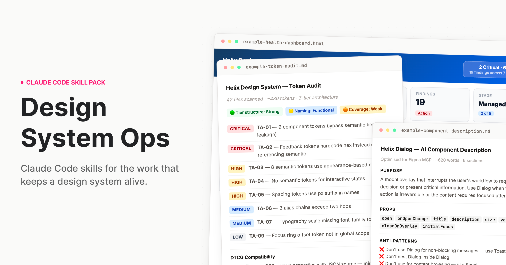

# Design System Ops



Claude Code skills for the work that keeps a design system alive.
[designsystemops.com](https://designsystemops.com)

---

## The work nobody built AI for

There are great AI tools for the designer who uses a design system. Generate a component, write a story, suggest a layout. That work is well-served.

But what about the team running it?

The token audits. The deprecation plans. The stakeholder briefs nobody reads until something breaks. The contribution workflows, the drift you fight quietly before it becomes someone else's emergency. The governance documentation. The onboarding that happens informally because there's no time to do it properly. The budget defence you prepare at 11pm before a quarterly review.

That work is hard, it's largely invisible, and it compounds badly when it doesn't get done. It also never had proper AI tooling — until now.

Design System Ops is built specifically for practitioners. Not designers who use a system. The people responsible for one.

---

## What this is

A skill pack for [Claude Code](https://docs.anthropic.com/en/docs/claude-code) and [Cowork](https://claude.ai) that teaches Claude how to do design systems work the way a staff-level practitioner would — with structured processes, expert frameworks, and output calibrated to the actual complexity of what you're dealing with.

When you ask Claude to audit your tokens, it doesn't give you generic advice. It reads your actual token files, identifies tier leakage, flags naming violations, produces a prioritised finding table with remediation guidance, and — if you're migrating to DTCG — gives you a sprint-plannable migration plan with hour estimates.

That is the difference. Not a smarter prompt. A different kind of output entirely.

**Who it's for:** Design systems leads, senior design engineers, and anyone responsible for a production design system. The people who run the system, not just the people who use it.

---

## Install

### Cowork (desktop app — easiest)

1. Download `design-system-ops.plugin` from the [`installable/`](installable/) folder
2. Open the Claude desktop app and start a Cowork session
3. Drop the `.plugin` file into the chat
4. Follow the install prompt — done

### Claude Code (terminal)

Clone this repo into your Claude Code skills directory:

```bash
git clone https://github.com/murphytrueman/design-system-ops.git ~/.claude/skills/design-system-ops
```

For project-level installation (instead of global):

```bash
git clone https://github.com/murphytrueman/design-system-ops.git your-project/.claude/skills/design-system-ops
```

**Verify:** Open Claude Code and say "How healthy is my design system?" If Claude responds with a structured, multi-step process — not generic advice — you're set up.

See [1-INSTALL.md](1-INSTALL.md) for the full guide with entry points by use case.

---

## What's included

### Skills

| Category | Skills | What they do |
|----------|--------|-------------|
| **Audit** | token-audit, component-audit, system-health, drift-detection, naming-audit, figma-variable-audit, codebase-index, system-benchmark | Understand what you actually have |
| **Govern** | contribution-workflow, deprecation-process, decision-record, change-communication, backlog-generator, version-bump-advisor, release-retrospective, governance-encoder, session-memory, codemod-generator, triage | Run the system as infrastructure |
| **Document** | ai-component-description, pattern-documentation, token-documentation, usage-guidelines, component-decision-tree, context-engine-builder, metadata-schema-generator | Make the system legible to humans and machines |
| **Validate** | design-to-code-check, accessibility-per-component, token-compliance, schema-validator, component-api-validator, cicd-integration | Verify quality before it ships |
| **Communicate** | adoption-report, stakeholder-brief, system-pitch, designer-onboarding, engineering-onboarding, visual-report | Move people and decisions |

### Agents

| Agent | What it chains | When to use it |
|-------|---------------|----------------|
| `/full-diagnostic` | 5 audit skills with cross-skill synthesis | Quarterly review or inheriting a system |
| `/release-check` | Design-to-code, accessibility, token compliance, AI description, usage guidelines, change communication | Before shipping any component |
| `/governance-review` | Adoption report, drift detection, stakeholder brief | Monthly or quarterly governance cadence |
| `/migration` | Token audit, naming audit, migration plan, codemod generation, communication | Planning a major migration |

### AI infrastructure skills

Five skills produce machine-readable files that AI agents and tooling consume directly: `context-engine-builder`, `governance-encoder`, `codebase-index`, `component-decision-tree`, and `metadata-schema-generator`. If you're building AI-native design system infrastructure, these are the files your agents need.

---

## Quick examples

**"I just want to know where we stand"**
→ Say: "How healthy is my design system?"

**"Our tokens are a mess"**
→ Say: "Audit my tokens"

**"I need to deprecate a component"**
→ Say: "Help me deprecate DatePicker in favour of DatePickerNext"

**"I need to convince leadership"**
→ Say: "Write a stakeholder brief for leadership about our design system"

**"Run the full pre-release pipeline"**
→ Say: "Run the release pipeline for Dialog"

You don't need to memorise skill names. Describe what you need and the right skill activates.

---

## Sample outputs

Real outputs from real codebases are in [`sample-outputs/`](sample-outputs/):

- **[example-token-audit.md](sample-outputs/example-token-audit.md)** — A complete audit of a ~480 token system: 11 findings across Critical/High/Medium/Low, specific code examples, DTCG alignment assessment, and a prioritised remediation roadmap.
- **[example-component-description.md](sample-outputs/example-component-description.md)** — A six-section MCP description for a React Dialog component: ~620 words of structured plain text for Figma.
- **[example-health-dashboard.html](sample-outputs/example-health-dashboard.html)** — An interactive HTML dashboard generated from audit findings: health radar, severity distribution, priority matrix, metric cards. Open in any browser.

---

## Configuration

Every skill works out of the box with no configuration. If you want to customise behaviour — severity overrides, Figma integration, GitHub API access, recurring trend tracking — create a `.ds-ops-config.yml` in your project root. An annotated template is included in the skill pack.

See [3-SETUP-AND-CONFIG.md](3-SETUP-AND-CONFIG.md) for the full configuration reference.

---

## Figma integration (optional)

Several skills become more powerful when Claude can read your Figma file directly. Two options:

- **[Figma Console MCP](https://github.com/southleft/figma-console-mcp)** (recommended) — Read and write access. Skills can write descriptions back into components, rename variables, create tokens.
- **[Standard Figma MCP](https://help.figma.com/hc/en-us/articles/32132100833559-Guide-to-the-Figma-MCP-server)** — Read-only access. Skills pull component data and variable collections.

Setup details in [1-INSTALL.md](1-INSTALL.md#setting-up-figma-integration).

---

## Requirements

- [Claude Code](https://docs.anthropic.com/en/docs/claude-code) or [Cowork](https://claude.ai) (Claude desktop app)
- Access to your design system's source files (tokens, components, config)
- Works with any stack: React, Vue, Twig, Tailwind, SCSS, CSS custom properties, Style Dictionary, Emotion, CSS-in-JS

---

## Documentation

| File | What it covers |
|------|---------------|
| [1-INSTALL.md](1-INSTALL.md) | Full installation guide with entry points by use case |
| [2-WHATS-INCLUDED.md](2-WHATS-INCLUDED.md) | Complete product documentation — every skill, agent, and knowledge note |
| [3-SETUP-AND-CONFIG.md](3-SETUP-AND-CONFIG.md) | Deep-dive setup, framework compatibility, monorepo handling, troubleshooting |

---

## Contributing

See [CONTRIBUTING.md](CONTRIBUTING.md).

---

## License

MIT — see [LICENSE](LICENSE).

---

## Support

If you found this useful, [buy me a coffee](https://buymeacoffee.com/murphytrueman).

---

## Author

**Murphy Trueman** — [designsystemops.com](https://designsystemops.com) · [hello@murphytrueman.com](mailto:hello@murphytrueman.com)

Built from 14 years of production design systems work. If it's in these skills, it's because it came up in real work.
