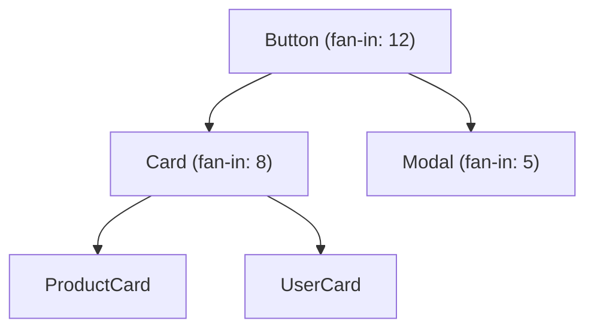

# Visual Report

A skill for transforming audit findings, system health statuses, and session history into visual outputs — interactive HTML dashboards, SVG charts, and Mermaid diagrams — that make design system health visible at a glance.

**Output type:** File creation. This skill produces HTML dashboard files, SVG chart files, or Mermaid diagram blocks that can be embedded in documentation, presentations, or shared directly.

---

## Why this exists

Numbers in a markdown table are accurate. They are also invisible. A stakeholder will not register "System health: 🟡 Functional with two weak dimensions" from a text report. But a radar chart showing dimension statuses — with red zones, amber zones, and green zones — communicates instantly.

Design system health data is inherently visual. Token coverage maps, component dependency graphs, severity distribution pie charts, trend lines over time — these are the natural representations of the data that audit skills produce. This skill bridges the gap between raw findings and visual communication.

## Boundaries

This skill visualises existing findings — it does not run audits or generate new data. If no audit output or session history exists, there is nothing to visualise; run the relevant audit skill first. If the request is for a written stakeholder summary rather than a visual artefact, use `stakeholder-brief` instead. This skill produces HTML dashboards, SVG charts, and Mermaid diagrams — if the request is for a slide deck or PDF, the visual output from this skill can feed into those formats but this skill does not produce them directly.

---

## Configuration

Check for `.ds-ops-config.yml` in the project root:

```yaml
visuals:
  brand_primary: "#0052CC"           # Primary colour for charts
  brand_secondary: "#FF5630"         # Accent colour for warnings/critical
  brand_success: "#36B37E"           # Success colour
  brand_neutral: "#6B778C"           # Neutral/baseline colour
  output_format: "html"              # html, svg, or mermaid
  output_directory: ".ds-ops/visuals"
```

If no configuration exists, use these defaults:
- Primary: `#2563EB` (blue)
- Secondary: `#DC2626` (red)
- Success: `#16A34A` (green)
- Neutral: `#6B7280` (grey)
- Output format: `html`
- Output directory: current working directory

---

## Input formats

This skill accepts any of these as input:

1. **Raw skill output** — Copy-pasted or referenced output from any audit skill
2. **Session memory files** — Files from the session-memory skill's directory
3. **System health statuses** — The dimension statuses from system-health
4. **Comparison data** — Before/after data from session-memory comparisons
5. **Manual data** — User-provided metrics in any format (will be normalised)

---

## Step 0: Determine the visual type

Based on the input data and the request, select one or more visual types:

### Visual types available

| Type | Best for | Format |
|---|---|---|
| **Health radar** | System health dimension statuses | Radar/spider chart |
| **Severity distribution** | Audit findings by severity | Donut chart |
| **Trend line** | Metric changes over time | Line chart |
| **Coverage heatmap** | Token or component coverage | Grid heatmap |
| **Dependency graph** | Component relationships | Mermaid flowchart |
| **Comparison bar** | Before/after comparisons | Grouped bar chart |
| **Action priority matrix** | Findings by effort vs. impact | Scatter plot |
| **Full dashboard** | Multiple visuals on one page | HTML dashboard |

If the request is vague ("make this visual"), choose the visual type that best fits the data:

- System health statuses → Health radar
- Audit findings → Severity distribution + action priority matrix
- Session history → Trend line
- Before/after data → Comparison bar
- Multiple data types → Full dashboard

---

## Step 1: Parse and normalise the data

### From audit output
Extract:
- Finding IDs, severities, categories
- Metric totals (violation counts, coverage percentages)
- Component names (for dependency graphs)
- Token tiers (for coverage heatmaps)

### From session memory
Extract:
- Dates and skill names
- Key metrics per session (aligned for trend lines)
- Deltas between sessions

### From system health
Extract:
- Seven dimension statuses (tokens, components, documentation, adoption, governance, AI readiness, platform maturity)
- Overall health status
- Maturity stage

### Normalise all data into simple structures:

```
metrics: [{ label, value, max, category }]
timeseries: [{ date, metric, value }]
findings: [{ id, severity, category, effort, impact }]
relationships: [{ source, target, weight }]
```

---

## Step 2: Generate the visuals

### Health radar chart

Produce a radar chart with seven axes (one per system health dimension). Map statuses to numeric values for charting: 🟢 Strong = 3, 🟡 Functional = 2, 🟠 Weak = 1, 🔴 Absent = 0.

Display axis labels using the status names, not numbers. The numeric mapping is internal for chart rendering only.

Colour coding:
- 0 (Absent): Red zone
- 1 (Weak): Amber zone
- 2 (Functional): Yellow-green zone
- 3 (Strong): Green zone

Implementation: Use Chart.js radar chart in HTML, or SVG polygon construction.

### Severity distribution chart

Produce a donut chart showing the distribution of findings by severity.

Ring segments:
- Critical: Red (`brand_secondary`)
- High: Orange (`#F59E0B`)
- Medium: Amber (`#D97706`)
- Low: Blue (`brand_primary`)
- Info: Grey (`brand_neutral`)

Centre text: Total finding count.

Implementation: Chart.js doughnut, or SVG arc paths.

### Trend line chart

Produce a line chart with time on the X axis and the metric on the Y axis. One line per metric being tracked.

Include:
- Data points marked with circles
- Hover tooltips with exact values
- A target line if configured
- Positive/negative trend annotation

Implementation: Chart.js line chart in HTML.

### Coverage heatmap

Produce a grid where:
- Rows = token categories or component areas
- Columns = coverage dimensions (primitive, semantic, component, documented, tested)
- Cells = colour-coded by coverage status (green = covered, amber = partial, red = missing, grey = not applicable)

Implementation: HTML table with CSS background colours, or SVG grid.

### Dependency graph

Produce a Mermaid flowchart showing component relationships:



Colour nodes by health status if data is available. Use line thickness to indicate dependency weight.

Implementation: Mermaid.js syntax block.

### Comparison bar chart

Produce grouped bars showing before/after values for each metric. One group per metric (e.g., violations, critical count, coverage %).

Colour coding:
- Improved metrics: Green bars (after < before for violations; after > before for coverage)
- Worsened metrics: Red bars
- Unchanged metrics: Grey bars

Include delta labels above each bar group: "↓ 33%" or "↑ 5%"

Implementation: Chart.js grouped bar chart in HTML.

### Action priority matrix

Produce a scatter plot where:
- X axis = Effort (Low → High)
- Y axis = Impact (Low → High)
- Each dot = one finding, sized by severity
- Quadrants labelled: "Quick wins" (low effort, high impact), "Strategic investments" (high effort, high impact), "Fill-ins" (low effort, low impact), "Consider carefully" (high effort, low impact)

Implementation: Chart.js scatter chart with quadrant overlays in HTML.

### Full dashboard

Combine multiple charts into a single HTML page with:
- A header showing system name, date, and overall health status
- A grid layout (2 columns on desktop, 1 column on mobile)
- Charts sized proportionally
- A summary section at the top with 3–5 key metric cards
- An interactive filter (if session history data is present): dropdown to switch between sessions

Implementation: Single self-contained HTML file with Chart.js loaded from CDN. No external dependencies beyond Chart.js. All data embedded inline.

---

## Step 3: Build the HTML dashboard (for full dashboard mode)

The dashboard is a single HTML file. Structure:

```html
<!DOCTYPE html>
<html lang="en">
<head>
  <meta charset="UTF-8">
  <meta name="viewport" content="width=device-width, initial-scale=1.0">
  <title>[System Name] — Design System Health Dashboard</title>
  <script src="https://cdn.jsdelivr.net/npm/chart.js"></script>
  <style>
    /* Inline styles — no external CSS */
    /* Use CSS Grid for layout */
    /* Responsive: 2 columns above 768px, 1 column below */
    /* Cards with subtle shadows for key metrics */
    /* Colour variables from config or defaults */
  </style>
</head>
<body>
  <header>
    <!-- System name, date, overall health status badge -->
  </header>
  <section class="metrics-cards">
    <!-- 3–5 key metric summary cards -->
  </section>
  <section class="charts-grid">
    <!-- Individual chart containers -->
  </section>
  <footer>
    <p>Generated by Design System Ops — visual-report</p>
    <p>[Date]</p>
  </footer>
  <script>
    // All chart configuration inline
    // Data embedded as JS objects
    // Chart.js instantiation for each chart
  </script>
</body>
</html>
```

### Key metric cards

Each card shows:
- Metric label (e.g., "Total violations")
- Current value (large font)
- Delta from previous session (if available, with arrow and colour)
- Sparkline trend (if 3+ data points available)

### Responsive behaviour

- Desktop (>768px): 2-column grid for charts, 3–5 cards in a row
- Tablet (768px): 2-column grid for charts, cards wrap to 2 per row
- Mobile (<768px): Single column, cards stack vertically

### Colour accessibility

- Never rely on colour alone to convey meaning
- Use patterns (dashed lines for targets, solid for actuals)
- Use labels on all chart segments
- Ensure contrast ratio ≥ 4.5:1 for all text
- Include a text-based summary below each chart for screen readers

---

## Step 4: Output

### For HTML dashboard
Save the file to the configured output directory:
`[output_directory]/[system-name]-dashboard-[YYYY-MM-DD].html`

### For individual charts (SVG)
Save each chart as a separate SVG file:
`[output_directory]/[chart-type]-[YYYY-MM-DD].svg`

### For Mermaid diagrams
Output the Mermaid syntax block inline in the conversation (for embedding in markdown documentation).

### For all formats
Also output a text-based summary of what the visuals show, so the findings are accessible without viewing the visual output:

```
Dashboard generated: agds-dashboard-2026-03-09.html

What the visuals show:
- Health radar: Strongest in Tokens (🟢 Strong), weakest in Documentation (🟠 Weak)
- Severity distribution: 12 findings — 2 Critical, 4 High, 4 Medium, 2 Low
- Trend: Violations decreased 33% since January
- Coverage: Feedback token category has zero coverage across all tiers
- Priority: 3 findings in the "Quick wins" quadrant — TA-04, NA-02, CA-11
```

---

## Integration with other skills

### As a follow-up to any audit skill
After any audit completes, suggest: "Run `visual-report` to generate charts from these findings."

### As part of the full-system-diagnostic agent
The diagnostic agent can chain visual-report after Phase 4 to auto-generate a dashboard from the full diagnostic output.

### As a companion to stakeholder-brief
When generating a stakeholder brief, suggest: "Run `visual-report` first and attach the dashboard to the brief."

### With session-memory
Load session history from memory files to produce trend lines across multiple runs.

---

## Quality checks

- All charts render correctly in a standard browser (Chrome, Firefox, Safari)
- No external dependencies beyond Chart.js CDN
- Colours pass WCAG AA contrast ratios
- Text summaries accompany every visual
- Dashboard is responsive across desktop, tablet, and mobile
- Data embedded inline — no external data fetches
- File saved to correct directory with correct naming convention
- Mermaid diagrams use valid syntax that renders in GitHub, GitLab, and Notion
- Provenance marker present: "Generated by Design System Ops — visual-report"
