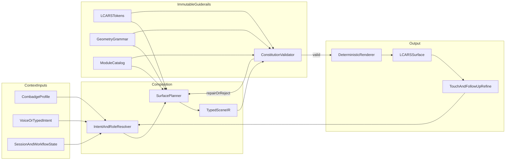

# LCARS Generative Interface Design

**Date:** 2026-08-07  
**Status:** Approved for implementation (2026-08-07)  
**Visual standard:** Star Trek TNG-era LCARS (Michael Okuda / Okudagram language)

## Summary

Build an LLM-forward adaptive console/shell that answers natural-language queries and workflows by **recomposing an LCARS surface**, not by hosting a chat transcript. Every pixel is drawn by a deterministic renderer from a typed Scene IR. A hybrid planner ships in v1 (curated recipes + model-filled modules). The same plumbing must support v2 dynamic topology. Nothing may render unless it passes an immutable LCARS constitution.

Primary use: research / baseline workspace, role-biased for engineer, physician, physicist, operations, security, and executive profiles. Voice and typed input both feed one intent pipeline.

## Goals

- Context, intent, and user identity drive legal LCARS assemblies.
- Hard definitions flex; they do not break. Dynamism is composition under rules.
- Interaction matches TNG computer use: brief, functional, multimodal; conversation only when analysis needs it.
- Data accuracy and representation purity are paramount, including 3D information displays.
- Accessibility is constitutional: APCA primary contrast, WCAG 2.2 AA fallback.

## Non-goals

- Chatbot-first shell or freeform model-emitted HTML/CSS.
- Decorative 3D unbound to data models and units.
- Role “skins” that abandon LCARS geometry or palette.
- Full free topology synthesis in v1 (hooks only; Approach 2 later).

## Research grounding (TNG interaction)

From Memory Alpha LCARS descriptions and Axtell & Munteanu, *Tea, Earl Grey, Hot* (CHI 2021) analysis of TNG computer speech:

- Interactions are mostly brief and functional (~95% under 10 turns; many single exchange).
- People lead with commands; questions rise in follow-ups.
- Roughly half of computer responses are action-only; the console is the reply.
- Multimodal and context-heavy; wake words drop when context already implies the computer.
- Conversation is exceptional, not the default shell.

Product implication: intent in → surface out → touch/voice refine. Dialogue is a constrained module when `analysisNeedsDialogue` is set.

## Architecture



### Layers

1. **Constitution (immutable)** — palette ramps, type rules, gutter/elbow math, APCA+AA contrast contracts, focus/motion a11y, allowed primitives. Versioned. No runtime escape hatch.
2. **Module catalog** — legal blocks with slots, density modes, a11y roles, refinement actions, allowed children.
3. **Surface planner** — v1 selects curated recipes and fills slots; v2 may synthesize topology. Same API: plans over the module graph under grammar scores.
4. **Typed Scene IR** — single IR family for v1 and v2. Invalid IR is repaired or rejected; never drawn.
5. **Deterministic renderer** — sole path to pixels. Includes 2D LCARS modules and sanctioned `viewport3d` interiors.
6. **Interaction loop** — intent → recompose → refine via IR patches.

**Hard invariant:** If a plan cannot be proven legal against the constitution, it does not render. Prefer constrained replan over best-effort drawing.

### Path from Approach 1 to Approach 2

| Era | Planner behavior | Still required |
|---|---|---|
| v1 Hybrid | Recipe select + content IR / slot fill | Full validator + catalog + grammar |
| v2 Scene IR | Dynamic topology from catalog | Same validator; no illegal primitives |

Defaults in v1 are compiled plans, not one-off pages, so v2 can build equivalent plans dynamically.

## Interaction model

### Primary loop

1. User issues short NL intent (voice or typed).
2. System resolves combadge profile + intent domain + session/workflow.
3. Surface recomposes. Success is usually visual, not a paragraph reply.
4. User refines via LCARS controls or short contextual follow-ups.
5. Multi-turn dialogue only when planner sets `analysisNeedsDialogue`.

### Query aperture

- Persistent typed field as reliable physical trigger (noise, privacy, precision).
- Voice (Web Speech API or equivalent) shares the same intent pipeline.
- Optional voice wake cue (“Computer”); typed needs none.
- Aperture lives in legal chrome (status rail / elbow end-cap), not a floating SaaS search bar.

### Intent classes

- `command` — do / open / filter (often silent UI change)
- `infoseek` — research as structured modules
- `analysis` — may allow dialogue turns
- `navigate` — switch workflow/surface focus
- `refine` — mutate current IR only

### Required surface states

idle/listening, working (LCARS “WORKING” pattern), result, empty-with-guidance, error/refusal (still LCARS-legal), partial/degraded (voice failed → typed focus), refine-pending.

## Identity (combadge)

Profile is first-class input to every plan.

| Field | Effect |
|---|---|
| Role pack | engineer, physician, physicist, operations, security, executive |
| Preference pack | density, accent family within legal palette, reduce-motion, verbosity |
| Clearance / tools | eligible modules and data sources |
| Recent workflow | recipe bias, sticky refinements |

v1: selectable mock profiles with this schema. Later: real auth, same shape.

Role reweights legal modules, density, and default recipe. It never invents chrome.

Role bias examples:

- **Physician** — confidence, caution bands, calmer density
- **Engineer** — schematics, telemetry, higher structured density
- **Physicist / research default** — claims, evidence, citations, compare panels
- **Operations** — status rails, exception queues
- **Security** — alerts and priority hierarchy; alert color used sparingly and legally
- **Executive** — fewer modules, clearer hierarchy, decision actions up front

## Visual constitution

**Scene:** Dim bridge or ready-room console; black field; backlit Okudagram color; glanceable, task-focused.

**Color strategy:** Full palette, constrained. Okuda-derived families only (purple/mauve, amber/orange, salmon/pink, cool blue/grey). Semantic roles: `frame.*`, `action.*`, `data.*`, `alert.*`, `neutral.*`, `ink.onFill`, `ink.onBlack`. No raw runtime hex outside tokens.

**Contrast:** APCA (Lc) is primary for token authoring and IR validate-time gates. WCAG 2.2 AA is the hard fallback. Pairs must meet the APCA target for the use case and must not fail AA. Validator reports both; repair picks nearest legal token that clears both.

**Geometry:** Black canvas; uniform gutters; legal primitives (elbow, bar, pill, rect, sweep, catalog-limited circular viewport). Hierarchy via large elbows vs small data blocks. Density modes: `sparse | standard | dense`. Seeded greeble for structured liveliness.

**Typography:** One highly condensed uppercase UI face (Okuda lineage or open licensed equivalent). Fixed rem product scale. Numbers first-class (tabular/lining where possible). Longer prose only inside a `prose` module.

**Motion:** Recompose 150–250ms, working pulse on status rail, press feedback on pills. `prefers-reduced-motion` → instant crossfade / no layout morph. No page-load choreography.

**Customization (legal):** density, accent family, reduce-motion, default role, quiet hours. **Illegal to customize:** gutter math, illegal shapes, contrast-breaking ink.

### v1 surface recipes

Compiled plans (same compiler as future dynamic plans):

1. Research / baseline workspace  
2. Engineering diagnostics  
3. Medical / clinical review  
4. Operations / security  
5. Command / executive summary  

Each recipe defines region map (left rail, header bands, main viewport, mode select, footer status), allowed modules, and role weight defaults.

## Scene IR and validation

Conceptual IR shape:

```ts
type SceneIR = {
  version: 1;
  surfaceId: string;
  role: RoleId;
  density: 'sparse' | 'standard' | 'dense';
  intent: IntentSnapshot;
  regions: Region[];
  modules: ModuleInstance[];
  focus: FocusHint;
  a11y: { liveMessage?: string; title: string };
  dialogue?: DialogueModule;
};
```

### Validator order

1. Schema + version  
2. Every `module.type` ∈ catalog  
3. Parent-child rules  
4. Geometry grammar  
5. Token references only  
6. APCA + WCAG AA for declared ink/fill uses  
7. Touch minima + complete focus order  
8. Density caps  
9. Role/clearance eligibility  
10. For `viewport3d`: registered model, units, encoding↔series integrity  

Fail → repair or reject with LCARS error band. Never partial-illegal paint.

### Refinement

Touch and follow-ups produce IR patches (`setFilter`, `setDensity`, `replaceModule`, `openDrillIn`, viewport scrub params). Re-validate, re-render. No chat-history IA required.

### Data binding

Modules bind to tool/result objects. LLM proposes bindings and copy; tools own facts. Series shapes must match schemas.

### Extensibility

New capability = new catalog module, any required token additions, and validator tests. Not a one-off page.

## Data-first 3D viewports

3D is an information display module inside legal LCARS chrome.

```ts
type Viewport3DBinding = {
  modelId: string;
  representation: 'wireframe' | 'shaded' | 'hybrid';
  series: DataSeries[];
  encodings: Encoding[];
  units: UnitSpec[];
  uncertainty?: UncertaintySpec;
  camera: 'schematic' | 'orbit' | 'fixed';
  annotations: Annotation[];
};
```

Rules:

- Visual channels map to declared series + units.
- Scales/legends/numeric readouts are sibling LCARS modules on the same series.
- Wireframe default for dynamics/schematics; shaded when form aids comprehension; hybrid allowed.
- Materials/lights stay palette-constrained.
- Uncertainty must be encodable; silent false precision is illegal.
- Accessible name + data summary required; key metrics remain in the 2D readout tree.

v1: 1–2 registered models (field/anomaly schematic + stellar/body wireframe) with mock series. v2+: richer registry and live feeds, same contracts.

Anti-goals: full-screen WebGL shell takeover; particle candy unbound to data.

## Accessibility and usability

**Floor:** APCA primary + WCAG 2.2 AA fallback for all rendered surfaces.

- Color never sole status channel.
- `prefers-reduced-motion` required; `prefers-contrast` maps to higher-contrast legal token variants.
- Full keyboard path; `:focus-visible` with legal high-contrast ring.
- Touch targets ≥ 44×44px (hit-slop preserved in dense mode).
- Voice failure focuses typed aperture with status note.
- Landmarks: banner, navigation, main, complementary, contentinfo.
- `aria-live` for recomposes (polite results, assertive alerts).
- Greeble `aria-hidden`; real data exposed with plain names.
- Narrow viewports collapse side into mode-select overlay; preserve elbows/rails (no card-stack redesign).
- Text zoom to 200% must not clip critical controls.

Usability: glanceability over prose; one job per region; refine-in-place; consistent module vocabulary; chat as last resort.

## Tech stack

| Concern | Choice |
|---|---|
| App | Vite + React + TypeScript |
| IR contracts | Zod (shared by planner, validator, renderer) |
| Tokens | Typed source → CSS variables; APCA+AA in CI and runtime validate |
| Render | React catalog modules only |
| Motion | Motion library; reduced-motion mandatory |
| 3D | Three.js + React Three Fiber inside `viewport3d`; `frameloop="demand"` when static |
| Voice | Web Speech API → shared intent pipeline |
| LLM | Pluggable adapter; structured plan/IR patches only |
| Tools | Interface + research stubs in v1 |
| Test | Vitest, Testing Library, visual fixtures |

### Repo layout

- `constitution/` — tokens, geometry, APCA/AA gates  
- `catalog/` — module definitions + React (+ R3F) renderers  
- `ir/` — Zod schemas, diffs/patches  
- `planner/` — context, intent, recipe select / future synthesize  
- `validator/` — constitution checks + repair  
- `runtime/` — session, combadge, voice/typed aperture  
- `recipes/` — v1 compiled surface plans  
- `models3d/` — registered data-driven visual models  
- `app/` — shell mounting runtime only  

## v1 delivery scope

Ships:

1. Immutable constitution + validator (illegal IR cannot paint)  
2. Module catalog for five recipes, including `viewport3d`  
3. Five recipes listed above  
4. Combadge mock profiles for six roles + preferences  
5. Voice + typed → plan → validate → render → refine  
6. Research/baseline end-to-end hero workflow  
7. Dialogue module only when flagged  
8. 1–2 registered 3D models with readout binding  
9. Gates: APCA+AA, keyboard paths, reduced-motion, golden fixtures  

Defers:

- Full free topology synthesis (API hooks only)  
- Real auth / physical combadge  
- Production speech beyond Web Speech API  
- Broad tool ecosystem beyond research stubs + model registry seed  

## Success criteria

- Same research query yields legal, role-biased LCARS surfaces for at least physicist and engineer profiles.  
- Refine by voice or touch without a chat transcript unless analysis demands dialogue.  
- No render path bypasses the validator.  
- 3D viewports stay data-bound with units and sibling readouts; wireframe and hybrid modes work.  
- Contrast pairs pass APCA targets and do not fail WCAG AA.

## Open decisions (defaults asserted)

- Open licensed condensed font chosen at implementation (Okuda-like metrics).  
- LLM provider selected via env adapter; local mock planner for offline tests.  
- Exact APCA Lc thresholds per use (body label vs large display vs non-text) set in constitution tables during token work, with AA as fallback gate.

## Implementation skill path

After this spec is approved: write the implementation plan (`docs/superpowers/plans/`), then build constitution → catalog → IR/validator → recipes → runtime aperture → research workflow → 3D viewport seed → a11y/visual gates.
